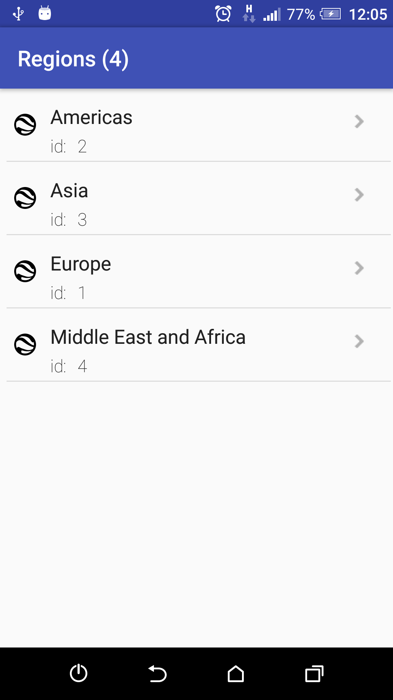
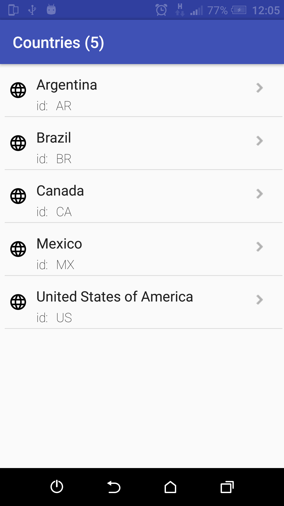
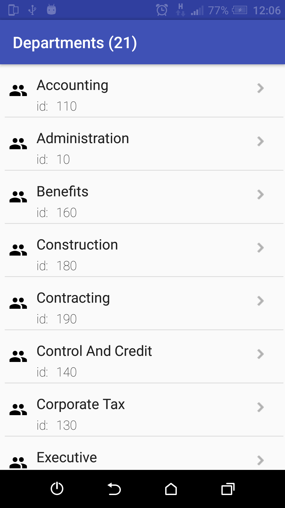
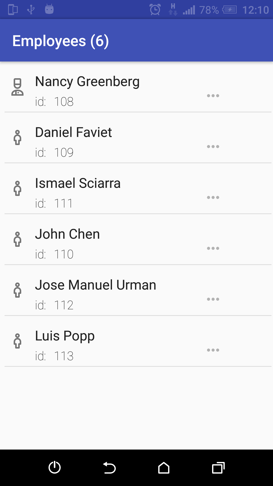
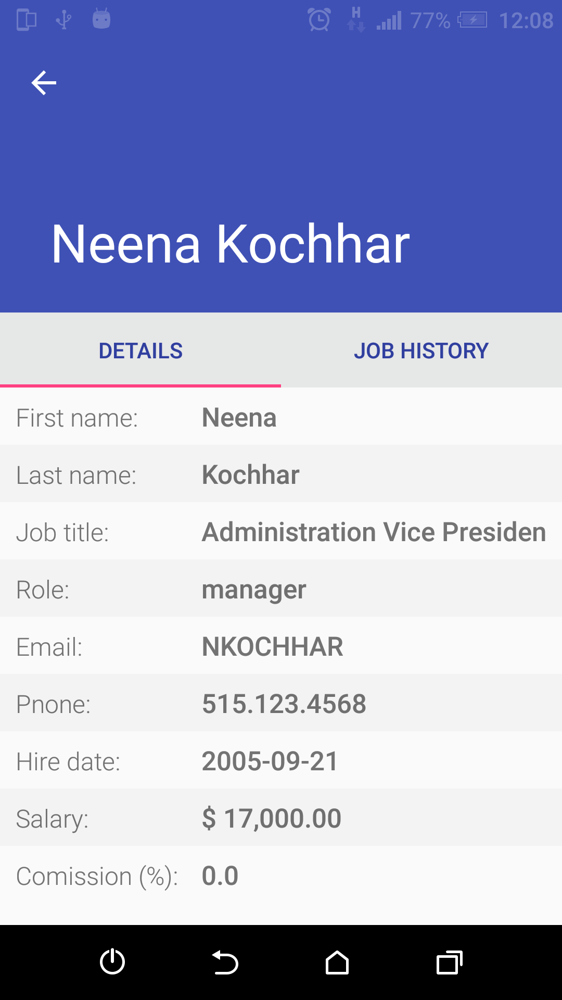

# *HRFusion*
*HRFusion is a small Android app, that navigates on "HR" SQLite database*.

#### Motivations:

- Researching POCO C++ Libraries on Android platform.

#### About

In spite of Android SDK provides built-in API for operating with SQLite,
the aim of this app is an integration of POCO libs and using
POCO's API to access to SQLite database
(see [*"POCO C++ Libraries Android Platform Notes"*](https://www.appinf.com/docs/poco/99300-AndroidPlatformNotes.html)).


As a database, there's used a reflection of Oracle Database 'HR' sample schema ("hr.db" file provided in "assets" folder).  
This one is produced by the utility [*"HRToSQLite"*](https://github.com/victorkryz/HRtoSQLite).


#### Built with:

- Android Studio 2.2.2
    - SDK (Build Tools 25)
    - NDK r13
    - JDK 1.8
- CMake (External Build) for C++ part
- *HRFusion.so* is built with: 
    - cpp flags - *'-std=c++11 -frtti -fexceptions'*
    - stl type - *'gnustl_shared'*

#### POCO libs integration:

This project uses POCO LIBS 1.7.5
([Download | POCO C++ Libraries ](https://pocoproject.org/download/index.html))

To make it buildable, do the next steps:

 - copy POCO LIBS headers under directory 'app/src/main/cpp/include':
 ```
  -- Poco
    |-- Data
    |   -- SQLite
    |-- Dynamic
    |    -- Util
    |-- ASCIIEncoding.h
    |-- AbstractCache.h
    |-- AbstractDelegate.h
    |-- ...
 ```

 - copy POCO libraries built for abi types 'armeabi', 'x86_64', etc.
   under directory 'app/src/main/jniLibs' respectively:

       ```
       .
       |-- armeabi
       |   |-- libPocoData.so
       |   |-- libPocoDataSQLite.so
       |   |-- libPocoDataSQLited.so
       |   |-- libPocoDatad.so
       |   |-- libPocoFoundation.so
       |   |-- libPocoFoundationd.so
       |   |-- libPocoJSON.so
       |   |-- libPocoJSONd.so
       |   |-- libPocoUtil.so
       |   |-- libPocoUtild.so
       |   |-- libPocoXML.so
       |   |-- libPocoXMLd.so
       `-- x86_64
           |-- libPocoData.so
           |-- libPocoDataSQLite.so
           |-- ...

       ```
    In this app are used the libraries built on NDK-toolchain with  cpp flags: *'-std=c++11 -frtti -fexceptions'*
    linked with stl type: *'gnustl_shared'*
    (see [*POCO C++ Libraries Android Platform Notes*](https://www.appinf.com/docs/poco/99300-AndroidPlatformNotes.html))


#### Testing:

 - JUnit tests are provided for all jni-calls against to HRFusion.so;
 - ReadHREntitiesFixture - the single fixture aggregates all test unit calls, to launch them in 'batch mode';

 Tested on abi types '*armeabi*', '*x86_64*'.


#### Screenshots
-----------------

  
  
  


