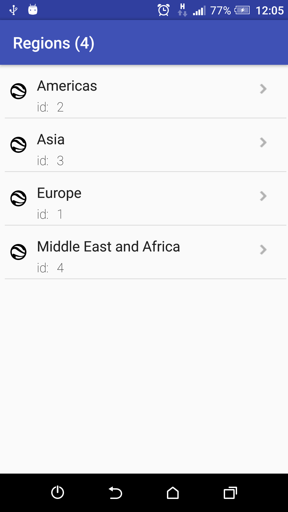
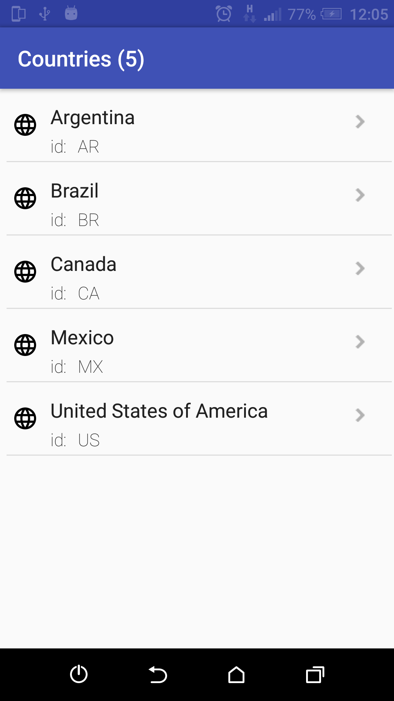
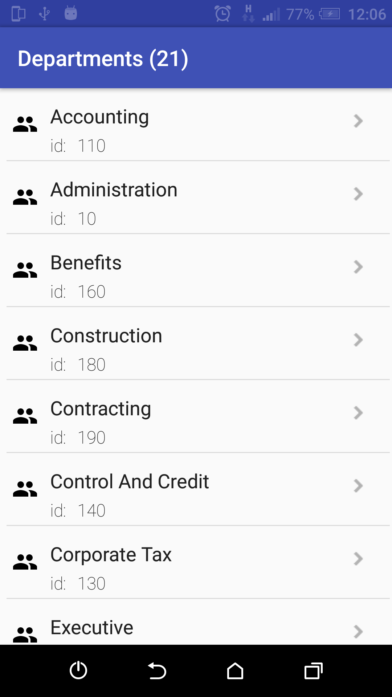
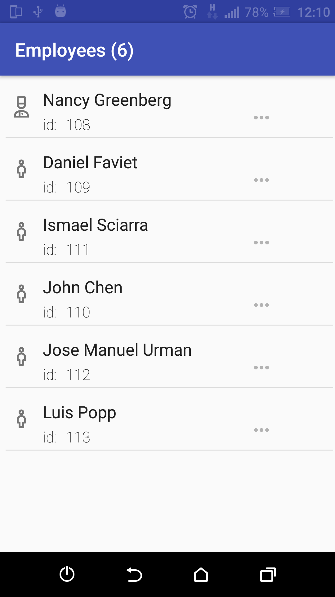
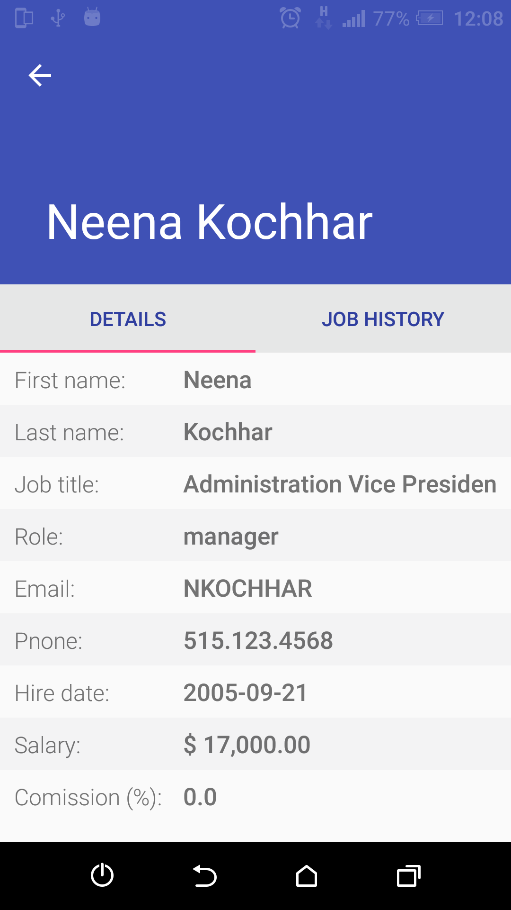
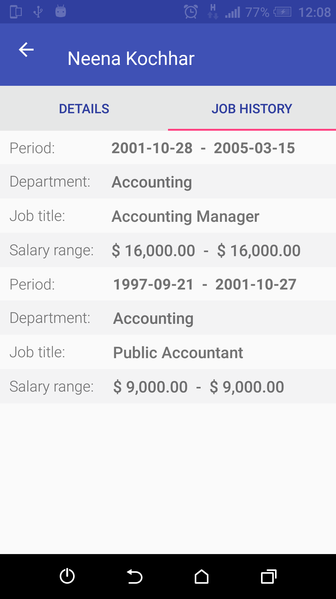

# $\color{JungleGreen}\textit{\textbf{HRFusion}}$

 
 

 

*HRFusion is a small Android app, that navigates on "HR" SQLite database*.

#### Motivations:

- Researching [*POCO C++ Libraries*](https://pocoproject.org/index.html) on Android platform.

#### About

In spite of Android SDK provides built-in API for operating with SQLite,
the aim of this app is an integration of POCO libs and using
POCO's API to access to SQLite database
(see [*"POCO C++ Libraries Android Platform Notes"*](https://docs.pocoproject.org/pro/99300-AndroidPlatformNotes.html)).

As a database, there's used a reflection of Oracle Database 'HR' sample schema ("hr.db" file provided in "assets" folder).  
This one is produced by the utility [*"HRToSQLite"*](https://github.com/victorkryz/HRtoSQLite).

## Build Configuration

The project uses a mixed Java/C++ Android build configuration based on:

- Android SDK Build Tools 29.0.3
- Android NDK r26d
- Android Gradle Plugin 4.0.0
- Gradle 6.1.1
- CMake External Native Build for the C++/JNI part

The native C++ layer is built with CMake and integrated into the Android application through Android Gradle Plugin external native build support.

The reference GitHub Actions workflow demonstrates:
- Android SDK/NDK environment setup
- POCO cross-compilation for Android
- JNI/C++ integration with Android Gradle build
- APK build execution

See the [GitHub Actions workflow](.github/workflows/linux-workflow.yml) configuration for the complete automated build scenario.

#### Testing:

 - JUnit tests are provided for all jni-calls against to HRFusion.so;
 - ReadHREntitiesFixture - the single fixture aggregates all test unit calls, to launch them in 'batch mode';

 
#### Screenshots
-----------------

  
  
  

